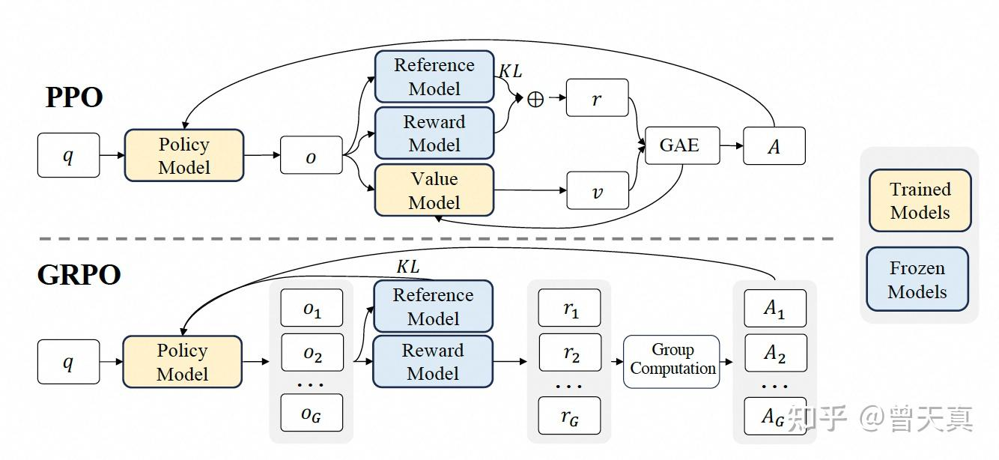

### DeepSeekMath: Pushing the Limits of Mathematical Reasoning in Open Language Models  
  
### GRPO(Group Relative Policy Optimization)梳理

[详解DeepSeek-R1核心强化学习算法：GRPO](https://zhuanlan.zhihu.com/p/21046265072) 👈这个是机翻(恼)😡
[无需RL基础理解 PPO 和 GRPO](https://zhuanlan.zhihu.com/p/27704969958) 👈这个不错，浅显易懂。大致理解PPO和GRPO的重点。

### Movitation
PPO 依赖于 Actor + Critic + 裁剪 + KL 惩罚框架。然而，在大型语言模型（LLM）场景中，Critic（价值函数）通常需要与 Actor 一样大才能准确评估状态，这可能成本高昂且有时不切实际——特别是如果你只有单一的最终奖励（如最终答案质量）。

因此，组相对策略优化（GRPO） 应运而生。其核心思想：
- 无需为 Critic 设置单独的价值网络
- 对同一问题或状态，从旧策略中采样多个输出
- 将这些输出的平均奖励视为基准
- 任何高于平均值的都产生“正优势”，任何低于平均值的都产生“负优势”

同时，GRPO保留了 PPO 的裁剪和 KL 机制，以确保稳定、合规的更新。

通过计算同一问题的多个输出的平均值并进行标准化，得出“相对分数”。这样，我们不再需要专用的价值函数，但仍能获得动态的“分数线”，简化训练并节省资源。

## 知识点
**Reference Model（参考模型）** 是一个冻结的基准模型，用于防止训练过程中模型过度偏移原始分布，确保稳定性。
一般来说，Reference Model 是“上一个训练阶段的最终模型”。

##### 不懂ref,new,old关系的可以看一下deepseek-math的GRPO部分的伪代码，写的很清楚。虽然我看伪代码也没看懂hh

**裁剪函数（Clipping Function）** 我们希望将其输出值限制在[a,b]区间内，那么使用裁剪函数clip（f(x),a,b）。函数值小于a就是a，大于b就是b，在中间就是输出的值。它主要用于对一些可能导致算法不稳定或不良影响的数值进行限制。

prompt进行右对齐，左边进行填充。
Group:用一个问题让大模型输出多个回答。
reference model是产生回答(completions)。
整句话输入得到reward。
DeepSeekMath是直接用大模型进行打分，R1基于规则（数学题有答案罢了，文体题按照格式）。
一个组内进行标准化得到advantages。
q 和 o 是从问题数据集和旧策略 πθ_old​​ 中采样的问题和输出。
**优势 $A_i$** ​ 是通过广义优势估计（Generalized Advantage Estimation, GAE）计算的。
超参数 ϵ 用于稳定训练过程。
一个流行但未经验证的假设是：**代码训练可以提高推理能力。**

## 易错点
GRPO最开始是在deepseek-math那里提出来的，那里GRPO用的还是神经网络的奖励模型。在R1的那里，才把推理数据的奖励换成了基于规则的。

## 流程

GRPO相比于PPo少用了reward model和value model.